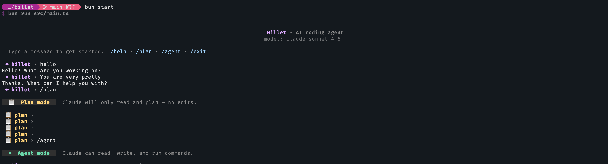

# Billet

A terminal-based AI coding agent built from raw [Anthropic SDK](https://docs.anthropic.com/en/docs/) primitives, [Bun](https://bun.sh), and TypeScript. No frameworks, no abstractions — just the agentic loop, tool use, and LLM API mechanics.

Billet runs an interactive REPL where you chat with Claude, and the model can run bash commands and view/edit files on your machine through tool use — all inside a sandboxed environment.

<p align="center">
  
</p>

## Quick Start

```bash
git clone https://github.com/stefanwille/billet.git
cd billet
bun install
cp .env.local.example .env.local
[Add an Anthropic API key to .env.local]
bun start
```

Billet needs an Anthropic API key. Grab one at [console.anthropic.com](https://console.anthropic.com/) and paste it into `.env.local`.

## Why I built it

I began building Billet by experimenting with an agentic loop. Then I remembered Boris Cherny's story about discovering the Claude model's inherent ability to code, and I wanted to see if I could reproduce the same thing in a basic setting, just providing a bash tool — and it worked. By writing the machinery myself instead of wiring up a framework, I had a great learning experience. The agentic loop, tool dispatch, the bash and text-editor tools are all hand-built on the raw Anthropic SDK. Building from primitives is the fastest way I know to see where the real engineering in an agent lives: context management, tool-result handling, and the control flow around the model.

## What It Does

```
> What files are in this directory?

┌─ bash ──────────────────────────────────────┐
│ {"command":"ls -la"}
├─ result ────────────────────────────────────┤
│ total 120
│ drwxr-xr-x  12 user  staff   384 Mar 10 09:00 .
│ -rw-r--r--   1 user  staff   847 Mar 10 09:00 package.json
│ drwxr-xr-x   5 user  staff   160 Mar 10 09:00 src
│ ...
└─────────────────────────────────────────────┘

Here are the files in the current directory: ...
```

The agent follows a classic **agentic loop**:

1. You type a message
2. The message is sent to Claude via the Anthropic API
3. Claude responds — possibly requesting tool calls (e.g. running a bash command)
4. Tool results are sent back to Claude
5. Steps 3–4 repeat until Claude produces a final text response
6. The response is rendered as formatted Markdown in your terminal

## Features

- **Interactive REPL** with persistent command history across sessions
- **Agentic loop** — multi-turn tool use with configurable max turns
- **Bash tool use** — Claude can run shell commands in a persistent bash session
- **Text editor tool** — Claude can view, create, and edit files directly (`view`, `create`, `str_replace`, `insert`)
- **Plan mode** — toggle with `/plan` and `/agent` in the REPL; in plan mode Claude will only read and plan, not make changes, until it calls a tool to switch back to agent mode
- **Terminal Markdown rendering** — headings, code blocks, tables, lists, bold/italic, links, all with ANSI colors
- **Bordered tool frames** — tool inputs and outputs are displayed in visual boxes
- **System prompt from CLAUDE.md** — automatically loads `~/.claude/CLAUDE.md` and `./CLAUDE.md`
- **Instant CLAUDE.md reloading** — changes to CLAUDE.md immediately affect the next turn
- **Pipe mode** — use non-interactively: `echo "what is 1+2" | bun start`
- **Model selection** — pick a model with `--model`/`-m` (`haiku`, `sonnet`, or `opus`)
- **Configurable working directory** — run against another project with `--cwd`
- **Error handling** — rate limits, connection errors, max tokens, and refusals
- **Sandboxing** — the agent runs inside an [`@anthropic-ai/sandbox-runtime`](https://www.npmjs.com/package/@anthropic-ai/sandbox-runtime) sandbox with configurable filesystem and network restrictions

## Getting Started

### Prerequisites

- [Bun](https://bun.sh) (v1.0+)
- An [Anthropic API key](https://console.anthropic.com/)

Bun automatically loads `.env.local`, so your API key is picked up without any extra config.

### Pipe Mode

You can also pipe input for non-interactive, single-shot usage:

```bash
echo "Explain the difference between TCP and UDP" | bun start
```

### Command-Line Options

```bash
bun start --model opus        # or -m; choices: haiku, sonnet, opus (default: sonnet)
bun start --cwd ../other-repo # run the agent against a different working directory
```

### REPL Commands

- `/plan` — switch to plan mode; Claude can only read and plan, not make changes
- `/agent` — switch back to agent mode; Claude can read, write, and execute
- `/help` — list available commands
- `/exit` (or `exit` / `quit`) — exit the REPL

## How It Works

**Agent Session** (`src/agent/agent-session.ts`) — holds all state for a conversation: the Anthropic client, message history, registered tools, mode (agent/plan), model configuration, and token counter.

**Agentic Loop** (`src/agent/agent-request.ts`) — the core loop. Sends the conversation to Claude, checks the stop reason, executes any requested tools, appends results to the message history, and loops until Claude says it's done (or we hit the max turn limit). When in plan mode, a `PLAN_MODE_ADDENDUM.md` snippet is appended to the system prompt to keep Claude read-only.

**Tool System** (`src/agent/tools/tool.ts`, `tool-list.ts`) — tools are defined with [arktype](https://arktype.io) schemas for input validation and registered per-session in `tool-list.ts`. Individual tools live under `src/agent/tools/available-tools/`.

**Bash Tool** (`available-tools/bash/bash.ts`, `bash-session.ts`) — spawns a long-lived bash process. Commands are sent via stdin with a UUID sentinel marker appended. The session polls stdout until the sentinel appears, then returns everything before it. 120-second timeout, 30KB output cap. Uses Anthropic's special `bash_20250124` tool type.

**Text Editor Tool** (`available-tools/text-editor/`) — implements Anthropic's `text_editor_20250728` tool type (`str_replace_based_edit_tool`), giving Claude `view`, `create`, `str_replace`, and `insert` commands for reading and editing files directly.

**Plan Mode** (`available-tools/exit-plan-mode.ts`) — an `exit_plan_mode` tool lets Claude switch the session back to agent mode once the user approves a plan. Toggled manually in the REPL via `/plan` and `/agent`.

**Markdown Renderer** (`src/agent/markdown-renderer/render-markdown.ts`) — a custom terminal Markdown renderer (no markdown library). Converts headings, code fences, tables, blockquotes, lists, inline formatting, and links into styled ANSI output.

**Sandbox** (`src/agent/sandbox/runProgramInSandbox.ts`) — wraps the agent process in an `@anthropic-ai/sandbox-runtime` sandbox. On first launch (no `SRT_SANDBOXED` env var), it loads `sandbox-settings.json`, initializes the sandbox policy, and re-spawns itself inside the sandbox. Policy controls filesystem read/write access and allowed network domains.

## Development

```bash
bun start              # Run the agent
bun test               # Run all tests
bun test render-markdown  # Run tests matching a name
bun run format         # Format with oxfmt
bun run lint           # Lint with oxlint
bun run typecheck      # TypeScript type check
bun run verify         # Run format, lint, typecheck, and test in sequence
```

### Tech Stack

| Component      | Choice                                             |
| -------------- | -------------------------------------------------- |
| Runtime        | [Bun](https://bun.sh)                              |
| Language       | TypeScript                                         |
| LLM API        | [Anthropic Claude API](https://docs.anthropic.com) |
| Default Model  | `claude-sonnet-4-6`                                |
| Schema Library | [arktype](https://arktype.io)                      |
| Formatter      | [oxfmt](https://oxc.rs)                            |
| Linter         | [oxlint](https://oxc.rs)                           |
| Test Runner    | `bun:test`                                         |


## A Little Story

When I showed Billet to my girlfriend, she asked it to program a more human-friendly UI for itself. Billet went ahead and built a better TUI.

<p align="center">
  
</p>

In case you are curious, the code for Billet's designed TUI is in this [commit](https://github.com/stefanwille/billet/commit/9d2fa29).


